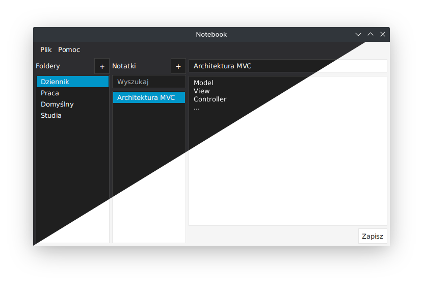

# Notebook
Aplikacja JavaFX do organizacji notatek

  

# Opis
Aplikacja umożliwia dynamiczną organizację oraz edycję notatek w dobranych pod własne potrzeby folderach. Kod źródłowy został napisany z myślą o architekturze MVC z wykorzystaniem zasady DRY.

Użytkownik ma możliwość tworzenia nowych folderów, notatek, zmiany nazw, usuwania oraz przeszukiwania dostępnych notatek po ich tytule.

Zawartość programu może być kontrolowana z wykorzystaniem zarówno menu kontekstowego, menu głównego jak i przycisków.

Aplikacja posiada dwa konsystentne style graficzne - jasny i ciemny. Styl może być dynamicznie przełączany w menu „Plik”.

Program posiada zintegrowane komunikaty, które umożliwiają wprowadzanie nazw lub chronią użytkownika przed przypadkowym usunięciem plików.

# Główne strefy
Aplikacja została zabezpieczona przed potencjalnymi błędami za pomocą dynamicznego zarządzania dostępnością głównych jej stref.

Aplikacja dzieli się na trzy główne strefy:
* lista folderów
* lista notatek
* edytor treści

Ich dostępność oraz zawartość jest aktualizowana kaskadowo.

# Organizacja kodu źródłowego
* controllers:	 (kontrolery)
* main:		 (metoda main)
* models:	 (modele)
* stylesheets:	 (kaskadowe arkusze stylów)
* toolkit:	 (klasy z metodami pomoczniczymi)
* views:	 (zawiera pliki .fxml)

# Wykorzystane oprogramowanie
* IntelliJ Idea
* SceneBuilder
* JavaFX SDK 16
* Java SDK 15
